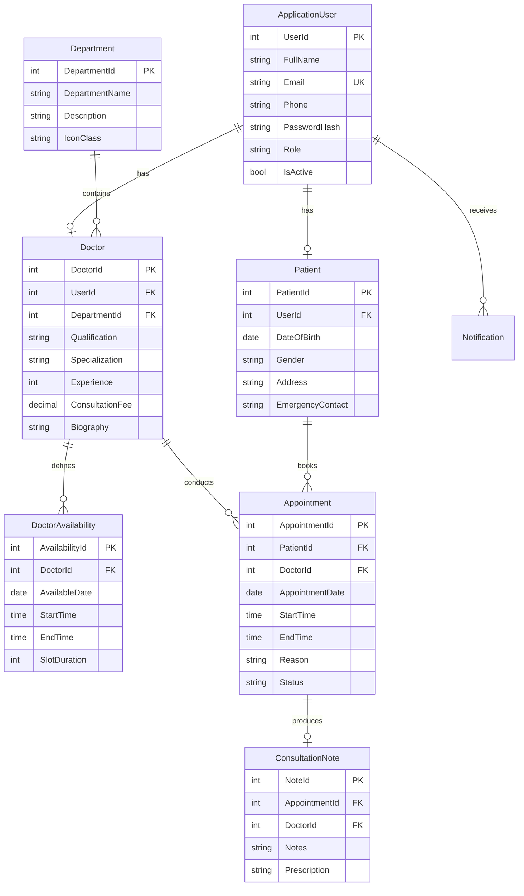
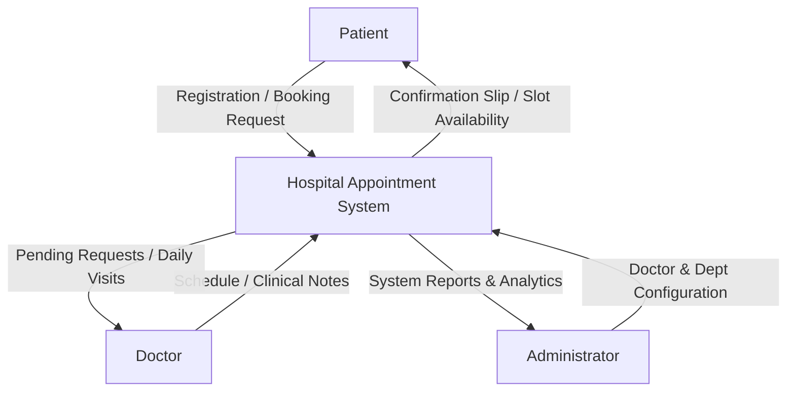

# Hospital/Clinic Appointment Booking System

> **B.Sc Computer Science Final-Year Academic Project Deliverable**  
> **Technology Stack:** ASP.NET Core MVC (.NET 8 / .NET 10), Entity Framework Core, Microsoft SQL Server / LocalDB / SQLite, Bootstrap 5, C#, Responsive UI/UX.

---

## 📋 Table of Contents

1. [Project Abstract](#-project-abstract)
2. [Key System Features](#-key-system-features)
3. [System Requirements Specification (SRS)](#-system-requirements-specification-srs)
4. [Software Architecture & Design](#-software-architecture--design)
5. [Use Case Diagram & Role Matrix](#-use-case-diagram--role-matrix)
6. [Entity-Relationship (ER) Diagram](#-entity-relationship-er-diagram)
7. [Data Flow Diagrams (DFD)](#-data-flow-diagrams-dfd)
8. [Module Descriptions](#-module-descriptions)
9. [Database Schema & Seed Data](#-database-schema--seed-data)
10. [Step-by-Step Installation & Execution Guide](#-step-by-step-installation--execution-guide)
11. [Comprehensive System Test Cases](#-comprehensive-system-test-cases)
12. [Project Deliverables Checklist](#-project-deliverables-checklist)

---

## 💡 Project Abstract

The **Hospital/Clinic Appointment Booking System** is a web-based healthcare management platform designed to eliminate waiting room delays, automate doctor schedule management, and streamline clinical consultation workflows. 

Developed using **ASP.NET Core MVC with C#** and **Entity Framework Core**, the system provides role-based web dashboards for **Patients**, **Doctors**, and **Clinic Administrators**. Patients can browse specialist doctors, search by medical department, check real-time calendar availability, book appointments, reschedule, and access digital consultation receipts. Doctors can manage working slots, approve or reject booking requests, access patient medical histories, and issue clinical notes with prescriptions. Administrators maintain full CRUD control over doctors, patients, departments, and system appointments, with built-in analytics reports and revenue estimation tools.

---

## ✨ Key System Features

* **Multi-Role Authentication & Security:** Secure login using ASP.NET Core Cookie Authentication with claims-based access control for Patients, Doctors, and Administrators. Passwords are securely hashed using `IPasswordHasher<ApplicationUser>`.
* **Dynamic Time Slot Calculation:** Automated slot generation based on doctor working hours and slot durations (e.g., 30-minute intervals).
* **Double Booking Prevention:** Database and server-side validation preventing overlapping appointment slots for doctors.
* **Patient Portal:** Interactive booking workflow, appointment rescheduling, cancellation, history tracking, and profile management.
* **Doctor Dashboard:** Daily consultation schedule, request approval/rejection queue, patient medical history view, and clinical note/prescription recording.
* **Admin Command Center:** Complete CRUD management for Doctors, Patients, and Departments, manual appointment status overrides, and date-filtered analytics reports.
* **Modern Healthcare UI/UX:** Clean Bootstrap 5 design styled with CSS variables (`#2563EB`, `#0F172A`, `#14B8A6`), responsive navigation sidebars, status badges, and soft card shadows.

---

## 🛠 System Requirements Specification (SRS)

### 1. Functional Requirements

* **FR1. Registration & Authentication:** Users can register as Patients and log in with email and password credentials. Role-based redirects send users to their respective portal.
* **FR2. Doctor Browsing & Search:** Patients can filter doctors by specialization, department, and view qualifications, experience, and consultation fees.
* **FR3. Appointment Booking:** Patients select dates and available time slots. Overlapping slots or past date bookings are strictly blocked.
* **FR4. Appointment Workflow Management:** Appointment statuses transition across `Pending` $\rightarrow$ `Confirmed` $\rightarrow$ `Completed` (or `Cancelled`/`Rejected`).
* **FR5. Clinical Consultation Notes:** Doctors can record examination findings and prescriptions upon completing visits.
* **FR6. Administrative Reporting:** Admins can filter clinic bookings by date ranges and view department revenue statistics.

### 2. Non-Functional Requirements

* **NFR1. Security:** Protection against SQL injection via Entity Framework Core parameterized queries, and XSS protection via Razor automatic HTML encoding.
* **NFR2. Performance:** Sub-second response times for time-slot lookups using optimized LINQ queries and indexed foreign keys.
* **NFR3. Usability:** Mobile-first responsive design usable across desktop computers, tablets, and smartphones.
* **NFR4. Reliability:** Automated database creation and seeding on application startup.

---

## 🏗 Software Architecture & Design

The solution follows a standard ASP.NET Core Model-View-Controller (MVC) architecture:

```
HospitalAppointmentSystem/
├── Controllers/
│   ├── HomeController.cs        # Public pages (Home, About, Doctors, Details, Contact)
│   ├── AccountController.cs     # Auth (Login, Register, Logout, Role redirects)
│   ├── PatientController.cs     # Patient Dashboard, Booking, Reschedule, History, Profile
│   ├── DoctorController.cs      # Doctor Dashboard, Schedule, Requests, Notes, Slots
│   ├── AdminController.cs       # Admin Command Center, CRUD Operations, Reports
│   └── AppointmentController.cs # RESTful AJAX endpoint for slot lookups
├── Models/                      # Entity Framework Core Domain Models
│   ├── ApplicationUser.cs
│   ├── Patient.cs
│   ├── Doctor.cs
│   ├── Department.cs
│   ├── DoctorAvailability.cs
│   ├── Appointment.cs
│   ├── ConsultationNote.cs
│   └── Notification.cs
├── ViewModels/                  # Strongly-typed Razor ViewModels
├── Services/                    # Business Logic Layer (AuthService, AppointmentService, NotificationService)
├── Data/                        # ApplicationDbContext & SeedData Initializer
├── Views/                       # Razor Views grouped by Controller & Shared Layouts
└── wwwroot/                     # Static CSS, JavaScript, and asset libraries
```

---

## 👥 Use Case Diagram & Role Matrix

### Use Case Diagram (Mermaid)

```mermaid
useCaseDiagram
    actor Patient
    actor Doctor
    actor Admin

    Patient --> (Register & Log In)
    Patient --> (Search & View Doctors)
    Patient --> (Book Appointment Slot)
    Patient --> (Reschedule / Cancel Booking)
    Patient --> (View Consultation Receipt)

    Doctor --> (Log In to Doctor Portal)
    Doctor --> (Manage Working Hours / Slots)
    Doctor --> (Approve / Reject Requests)
    Doctor --> (View Daily Schedule)
    Doctor --> (Record Consultation & Rx Notes)

    Admin --> (Manage Doctors CRUD)
    Admin --> (Manage Patients CRUD)
    Admin --> (Manage Departments CRUD)
    Admin --> (Override Appointment Status)
    Admin --> (View Clinic Analytics & Reports)
```

---

## 🗄 Entity-Relationship (ER) Diagram



---

## 🔄 Data Flow Diagrams (DFD)

### Level 0 DFD (Context Diagram)



---

## 📦 Module Descriptions

1. **Authentication & Authorization Module:** Handles user registration, hashed password verification, cookie authentication, role-based authorization filters (`[Authorize(Roles = "...")]`), and security redirects.
2. **Public Website Module:** Provides an intuitive homepage with doctor search by name or department, featured doctor cards, department highlights, about us details, and contact support forms.
3. **Patient Dashboard Module:** Dashboard displaying upcoming appointment alerts, quick booking wizard, slot availability lookups via AJAX, booking rescheduling, cancellation, and medical receipt viewing.
4. **Doctor Dashboard Module:** Dashboard for doctors showing today's patient roster, pending booking request queues, schedule configuration, patient profile lookup, and clinical note/prescription recording.
5. **Admin Management Module:** Command center enabling complete CRUD operations for Doctors, Patients, and Departments, system-wide appointment oversight, status overrides, and date-range analytics.

---

## 💻 Database Schema & Seed Data

The application automatically seeds standard test credentials upon first execution:

| User Role | Email Address | Password | Description |
| :--- | :--- | :--- | :--- |
| **Administrator** | `admin@hospital.com` | `Admin@123` | System Administrator with full CRUD control |
| **Doctor** | `sarah.jenkins@hospital.com` | `Doctor@123` | Senior Cardiologist (Cardiology Dept) |
| **Doctor** | `michael.chen@hospital.com` | `Doctor@123` | Neurologist (Neurology Dept) |
| **Patient** | `patient1@gmail.com` | `Patient@123` | Sample Patient (John Doe) |
| **Patient** | `patient2@gmail.com` | `Patient@123` | Sample Patient (Jane Smith) |

---

## 🚀 Step-by-Step Installation & Execution Guide

### Method A: Execution via Visual Studio 2022

1. **Prerequisites:** Install [Visual Studio 2022](https://visualstudio.microsoft.com/vs/) with the **ASP.NET and web development** workload and SQL Server / LocalDB.
2. **Open Solution:** Double-click `HospitalAppointmentSystem.csproj` or open the solution folder in Visual Studio.
3. **Database Setup (SQL Server):**
   - Open `appsettings.json` and ensure the connection string matches your local SQL Server instance:
     ```json
     {
       "DatabaseProvider": "SqlServer",
       "ConnectionStrings": {
         "DefaultConnection": "Server=(localdb)\\mssqllocaldb;Database=HospitalAppointmentDb;Trusted_Connection=True;MultipleActiveResultSets=true;TrustServerCertificate=True"
       }
     }
     ```
4. **Run Application:** Press `F5` or click **Start Debugging** in Visual Studio. The database will be created and seeded automatically.

### Method B: Execution via .NET CLI

1. **Open Command Prompt / Terminal** in the project directory:
   ```bash
   cd "c:\Users\ELCOT\Desktop\hospital management"
   ```
2. **Build Project:**
   ```bash
   dotnet build
   ```
3. **Run Project:**
   ```bash
   dotnet run --urls=http://localhost:5000
   ```
4. **Access Web Application:** Open your browser and navigate to `http://localhost:5000`.

---

## 🧪 Comprehensive System Test Cases

| Test ID | Feature | Test Scenario | Input Data | Expected Result | Result |
| :--- | :--- | :--- | :--- | :--- | :--- |
| **TC-01** | Auth | Patient Registration | Valid patient details & matching passwords | User created, redirected to Login with success message | **PASS** |
| **TC-02** | Auth | Login Validation | Correct email & password | Authenticated, redirected to role dashboard | **PASS** |
| **TC-03** | Auth | Invalid Login | Incorrect password | Error message displayed, access denied | **PASS** |
| **TC-04** | Booking | Slot Generation | Select Doctor ID 1 & Date | Available 30-min time slots returned via AJAX | **PASS** |
| **TC-05** | Booking | Double-Booking Prevention | Book slot already taken | System rejects booking with slot unavailable message | **PASS** |
| **TC-06** | Booking | Past Date Prevention | Select yesterday's date | Booking blocked by server validation | **PASS** |
| **TC-07** | Doctor | Request Approval | Doctor clicks "Approve" | Status updated to `Confirmed`, notification generated | **PASS** |
| **TC-08** | Doctor | Add Clinical Note | Enter consultation notes & Rx | Note saved, status updated to `Completed` | **PASS** |
| **TC-09** | Patient | Reschedule Booking | Select new date and slot | Appointment updated, doctor notified | **PASS** |
| **TC-10** | Admin | Create New Doctor | Valid doctor form submitted | Doctor user & profile saved, added to directory | **PASS** |
| **TC-11** | Admin | Create Department | New department details | Department created with icon & specialty listing | **PASS** |
| **TC-12** | Admin | View Reports | Filter date range | Total bookings, revenue, and department stats rendered | **PASS** |

---

## ✅ Project Deliverables Checklist

- [x] **Complete ASP.NET Core MVC C# Source Code**
- [x] **Normalized SQL Server & SQLite Database Models**
- [x] **Entity Framework Core Code-First DbContext & Automated Data Seeder**
- [x] **Role-Based Authentication & Authorization (Admin, Doctor, Patient)**
- [x] **Modern Responsive UI/UX (Bootstrap 5, Custom CSS Variables, Icons)**
- [x] **AJAX Dynamic Time-Slot Lookups & Double-Booking Validation**
- [x] **Comprehensive Documentation (SRS, ER Diagram, DFD, Use Cases, Test Cases)**
